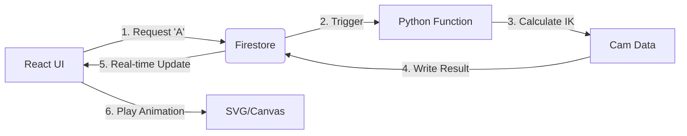

# 🖋️ Project: ScribeCam 

A minimalist tool to turn text into mechanical cam profiles.

## 🛠️ Tech Stack

* **Frontend:** React (Vite) + Framer Motion (Animation).
* **Backend:** Firebase Cloud Functions (Python 3.11).
* **Database:** Firestore (Job tracking).
* **Storage:** Firebase Storage (STL/CSV export).

---

## 📋 The "First-Sprint" Tasklist

### **Module 1: The Geometry Engine (Python)**

* [ ] **Path Mapping:** Create a dictionary of  coordinates for numbers 0–9.
* [ ] **Inverse Kinematics (IK):** Write a function to convert  coordinates into Cam Radius  at Angle .
* *Target:* Output a JSON array of 360 values (one for each degree).


* [ ] **Validation Script:** A local Python script to plot the cam profile using `matplotlib` to ensure it looks "mechanical."

### **Module 2: The Serverless Bridge (Firebase)**

* [ ] **Function Trigger:** Set up a `on_call` Python Cloud Function.
* [ ] **Data Flow:** Function receives `text`, runs Module 1, and saves the resulting JSON array to Firestore.
* [ ] **Storage:** Add a basic CSV export generator that saves to Firebase Storage.

### **Module 3: The Minimalist UI (React)**

* [ ] **Input:** A single text input field (limited to 1 character for MVP).
* [ ] **The "Scribe" Animation:** * Animate an SVG circle (The Cam) rotating.
* Animate a vertical line (The Follower) moving up/down based on the JSON array.
* Animate the "Pen" drawing the path simultaneously.


* [ ] **Status Listener:** Use `onSnapshot` to watch Firestore for the moment the Python math is finished.

---

## 🏗️ Logical Architecture



---

## 🧪 Minimal Test Case (The "Circle Test")

To verify the system without complex kinematics:

1. **Input:** "Circle".
2. **Expected Math:** The IK should return a constant radius (a perfect circle cam).
3. **Expected Animation:** The cam rotates, the follower stays perfectly still, and the "Pen" draws a circle on the screen.
4. **Success:** If the "Circle Test" works, the pipeline is ready for complex alphanumeric paths.

---

## 📝 Simplified README.md

```markdown
# ScribeCam MVP

## Setup
1. `cd functions && pip install -r requirements.txt`
2. `firebase deploy --only functions`
3. `cd frontend && npm install && npm run dev`

## How it works
1. User enters a character.
2. Firebase Python Function calculates the inverse kinematics of a 2-link arm.
3. The frontend receives a 360-point array of radii.
4. Framer Motion maps these points to an SVG rotation to simulate the mechanism.

## Current Limitations
- Supports 0-9 only.
- 2D Preview only

## Tests

1. Circle test
2. Square test
3. Alphanumeric test